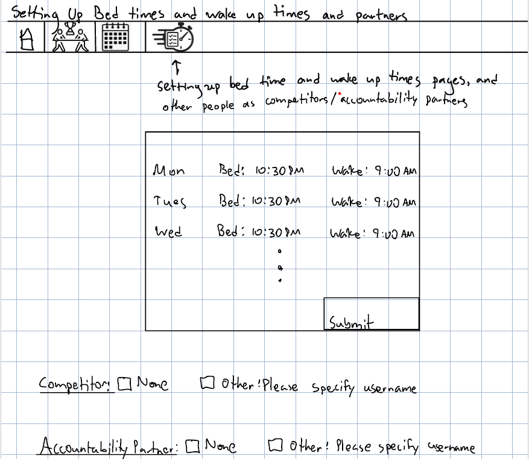
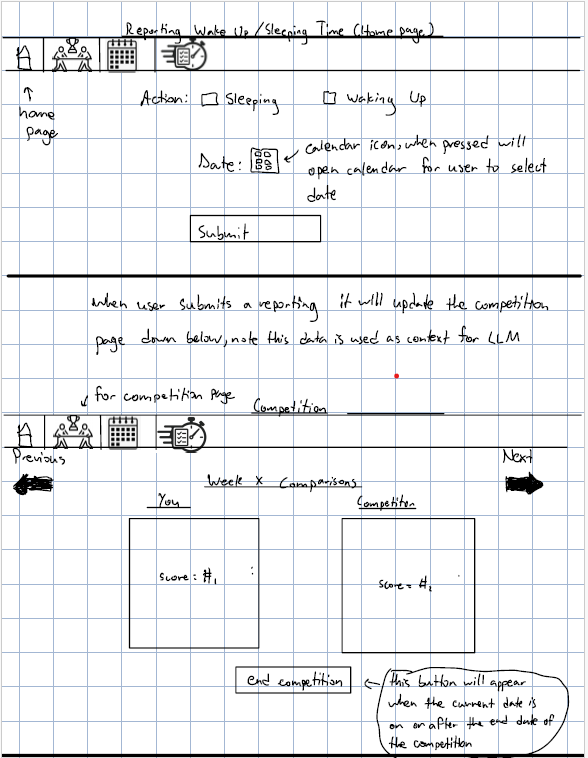
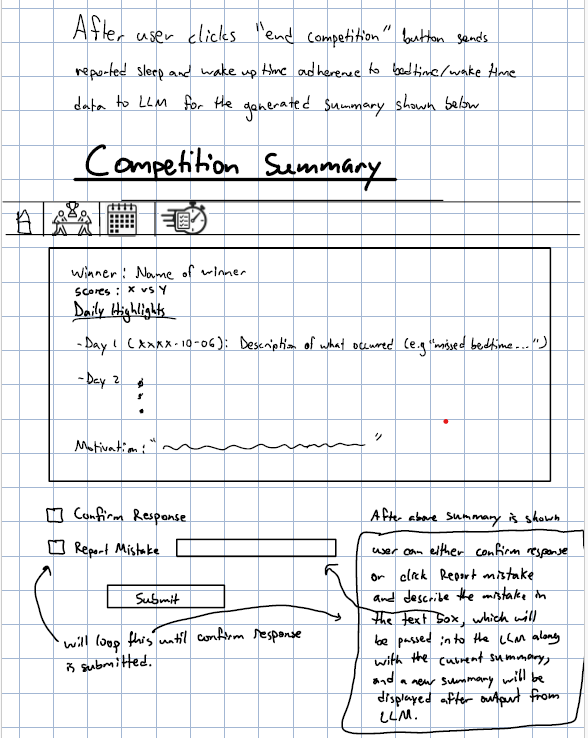

# Assignment 3- LLM Augmentation

# Concepts
## Original Competition concept without LLM augmentation
CompetitionManager[User] concept:
- **concept** CompetitionManager[User]
- **purpose** manage multiple sleep-adherence competitions between users, each tracking daily bedtime and wake-up performance over a defined time period and establishing a winner based off of scores, while ensuring competitions do not overlap for the same user.
- **principle** A user sets up a competition with another user from a certain start date to an end date. Users' sleep adherences according to their set bedtimes and wake up times are reported. A score is calculated for each user at the end of the competition and a winner is established.
    - a set of Competitions with:
        - user: User
        - challenger: User
        - startDate: Date
        - endDate: Date
        - a set of userStats with
            - user: User
            - date: Date
            - bedtimeSuccess: Boolean
            - wakeupSuccess: Boolean
            - dailyScore: Number
        - outcome: String
        - summary: String
- **invariants**
    - each competition’s user and challenger are distinct
    - no two competitions overlap in time for the same participant
    - each userStat’s date lies within [startDate, endDate] of its competition
    - dailyScore = (1 if bedtimeSuccess == true else -1 if bedtimeSuccess == false else 0) +(1 if wakeUpSuccess == true else -1 if wakeUpSuccess == false else 0)
- **actions**
    - startCompetition(user:User, challenger:User, start:Date, end:Date)
        - **requires**: user is not the challenger and no overlapping Competition already exists
        - **effects**: create a Competition with empty dailyUserStats, blank outcome, and blank summary
    - recordStat(u:User, d:Date, event:Boolean, success:Boolean)
        - **requires**:
            - u is part of a Competition
            - d is within startDate and endDate of that Competition
        - **effects**:
            - finds or creates a userStat for (u, d)
            - updates bedtimeSuccess or wakeUpSuccess
            - recomputes dailyScore using invariant formula
    - endCompetition(c:Competition): status:Number
        - **requires**: current date is greater than or equal to the endDate of Competition
        - **effects**: set and return the outcome of who won by aggregating the daily scores of the user and challenger, where 0 represents user winning, 1 represents challenger winning, and 2 represents a tie
    - summarizeCompetition(c:Competition, llm:GeminiLLM): String
        - effects: Calls the llm to generate a natural-language summary that shows the highlights for each day within the start date and the competition, as well as scores and who won, and finally a motivational message at the end to provide supportive feedback and encouragement.

## Updated Competition concept with LLM Augmentation
CompetitionManager[User] concept:
- **concept** CompetitionManager[User]
- **purpose** manage multiple sleep-adherence competitions between users, each tracking daily bedtime and wake-up performance over a defined time period, ensuring competitions do not overlap for the same user, and generating validated summaries with an LLM
- **principle** A user sets up a competition with another user from a certain start date to an end date. Users' sleep adherences according to their set bedtimes and wake up times are reported. A score is calculated for each user at the end of the competition and a winner is established. A LLM is used to summarize the competition by providing a daily description for the dates within the start and end date of the competition, and the scores are displayed as well as the winner (or tie if equl scores), and finally a motivational message is displayed to encourage participants.
- **state**
    - a set of Competitions with:
        - user: User
        - challenger: User
        - startDate: Date
        - endDate: Date
        - a set of userStats with
            - user: User
            - date: Date
            - bedtimeSuccess: Boolean
            - wakeupSuccess: Boolean
            - dailyScore: Number
        - outcome: String
        - summary: String
- **invariants**
    - each competition’s user and challenger are distinct
    - no two competitions overlap in time for the same participant
    - each userStat’s date lies within [startDate, endDate] of its competition
    - dailyScore = (1 if bedtimeSuccess == true else -1 if bedtimeSuccess == false else 0) +(1 if wakeUpSuccess == true else -1 if wakeUpSuccess == false else 0)
- **actions**
    - startCompetition(user:User, challenger:User, start:Date, end:Date)
        - **requires**: user is not the challenger and no overlapping Competition already exists
        - **effects**: create a Competition with empty dailyUserStats, blank outcome, and blank summary
    - recordStat(u:User, d:Date, event:Boolean, success:Boolean)
        - **requires**:
            - u is part of a Competition
            - d is within startDate and endDate of that Competition
        - **effects**:
            - finds or creates a userStat for (u, d)
            - updates bedtimeSuccess or wakeUpSuccess
            - recomputes dailyScore using invariant formula
    - endCompetition(c:Competition): status:Number
        - **requires**: current date is greater than or equal to the endDate of Competition
        - **effects**: set and return the outcome of who won by aggregating the daily scores of the user and challenger, where 0 represents user winning, 1 represents challenger winning, and 2 represents a tie
    - summarizeCompetition(c:Competition, llm:GeminiLLM): String
        - effects: Calls the llm to generate a natural-language summary that shows the highlights for each day within the start date and the competition, as well as scores and who won, and finally a motivational message at the end to provide supportive feedback and encouragement.

# Design of User Interaction
## INCLUDE SKETCH AND FINISH THIS PART
Problem trigger: Alex is a college student who often stays up until 2 AM finishing assignments. His irregular schedule leaves him exhausted in morning classes and irritable with his roommates. After oversleeping and missing another lecture, Alex realizes he needs help establishing a healthier routine. He realizes that he also finds it easier to stick to goals when held accountable by others so he wants others to assist him on his journey to improving sleep habits. So, Alex opens ShutEye Showdown and navigates to the “Setting Up Bedtimes and Wake-up Times” page He enters his goals: bedtime at 10:30 PM and wake-up at 9:00 AM for weekdays, and 11:00 PM to 10:00 AM on weekends. He then begins a competition with his roommate that would last until next week. Accross the span of the week he and his roomate open the "Reporting Wake Up/Sleeping Time" page to log their waking up and sleeping time. Then at the end of the week Alex is curious about the results of the competition and wishes to see a summary of his sleep and wake up habits across the week compared to his roommate and feedback/motivation. So, he clicks the "end competition" button in the "Competition" page. This sends all of the data as to whether or not the user adhered to their sleeping and wake up times per day to an LLM to displays the winner, scores, daily highlights with short descriptions of what transpired (for example "Alex slept past his bedtime but woke up on time"), and finally a motivational text at the end. Alex noticed that his total score was miscalculated so he reported a mistake by typing it into the "Report Mistake" text box. This placed the last summary displayed to the user and the mistake reported back into the LLM as context to then update the summary fixing the issue. Alex, then sees that the total score was correctly calculated and clicks "confirm response" and clicks the submit button. So Alex, was able to have a competition against his roommate and at the end see how he compared against him as well as see a summary of his sleep habits with the daily highlights, and finally was motivated and given feedback for the next week.

# Explore richer test cases and prompts
## Test case 3- Observing how the LLM handles when a user forgets to record their bedtime and/or wake up success/failure on some days within [startDate, endDate]

## Full scenario with user/LLM actions
1. The user (Ava) creates a new competition with a challenger (Noah), running for five consecutive days.
    - (Action: manager.startCompetition("Ava", "Noah", start, end))

2. Over the days for the competition, Ana's success/failure of adhering to bed time and wake up times is reported. But Noah's are only reported for the first three out of five days of the competition.
    - (Actions: multiple manager.recordStat() calls for both users, omitting the last two days for "Noah".)

3. The user ends the competition before Noah has logs his .
    - (Action: manager.endCompetition(comp))

4. The system passes all recorded stats to the LLM for summarization.
    - (Action: manager.summarizeCompetition(llm, comp))

The LLM receives context including:

Competition name, start/end dates

Each participant’s per-day boolean stats for “bedtime” and “wakeup”

Missing entries for the final two days
The model is prompted to generate a fair summary comparing participants’ consistency and effort, even with incomplete data.

## Results:
- The LLM didn't properly handle this scenario in which the competition was a total of 5 days, but one of the users (Noah) did not report their bedtime/wake-up success/failure. What ended up happening with this test case, was that the LLM only demonstrated the daily highlights for the first three days in which both users logged their bedtime/wake-up success/failures while ignoring the last two days where only Ava's sleep habits were scheduled.
1. Prompt variation 1 to solve this issue:
    - My approach when solving this issue was adding more instructions in my numbered list of instructions that the LLM must follow in the prompt. I added another instruction to add daily highlights even if one or more of the users in the competition did not report their bedtime/wake-up time adherences, and I told the LLM to acknowledge that they forgot to report data. (This was the instruction added: "Add dailyHighlights even if some days only have data for either ${comp.user} or ${comp.challenger} or even
   there is no data for both acknowledge that ${comp.user} and/or ${comp.challenger} forgot to report for that day.") The prompt variation provided some solutions, but there still remained flaws. The solution was that now the LLM provided a description for all 5 days within the competition instead of only stopping at the first 3 days (the days that both users reported data). However, what was flawed was that for the last two days Ava reported data while Noah did not, but the LLM grouped Noah's failure to report data with Ava saying that for the last two days both Ava and Noah did not report data.
2. Prompt variation 2
    - For Prompt Variation 2, I modified the instructions so the LLM explicitly iterated through every date in the competition range and produced a highlight for each day, even if one or both users failed to report. This change fixed the earlier issue where the model stopped at Day 3—it now generated all five days correctly and recognized that Ava continued logging data through Day 4. However, on Day 5 it still incorrectly stated that both participants missed their goals, even though only Noah failed to report. While this version improved completeness and accuracy, it still lacked explicit acknowledgment when a single user didn’t submit data, showing that the model needs stronger per-user presence checks and clearer phrasing rules to eliminate generalizations like “both missed.”
3. Prompt variation 3:
    - For Prompt Variation 3, I refined the instructions to explicitly show how the LLM should handle days when only one participant reports data, providing a clear example (“Ava reported results, but Noah did not submit data”). This adjustment successfully fixed the earlier overgeneralization issue—now the model correctly identified that Ava continued to report data while Noah did not on Days 4 and 5. The daily highlights became more precise and individualized, accurately distinguishing between partial and complete missing data. The prompt effectively eliminated false statements like “both missed data.” The only minor limitation that remains is stylistic: the phrasing could still be made slightly more natural and varied, but in terms of factual accuracy and structure, this variation resolved the previous issues entirely.

    # Test case 4- Tie scores but unequal participation
    ## Full Scenario
    1. The user (Ava) creates a new competition with a challenger (Noah), running for five consecutive days.
        - (Action: manager.startCompetition("Ava", "Noah", start, end))
    2. Both Ava and Noah report their bedtime and wake-up adherence for the first three days of the competition.

        - (Actions: multiple manager.recordStat() calls for both users covering Days 1–3.)
    3. For the last two days, only Noah reports data, while Ava fails to log her bedtime and wake-up results.
        - (Actions: manager.recordStat() calls for Noah only on Days 4–5.)
    4. The competition is ended, and all stats are passed to the LLM for summarization.

        - (Actions: manager.endCompetition(comp) → manager.summarizeCompetition(llm, comp))

    ## Result
In this test, the LLM correctly computed that both participants tied with scores of 0 vs 0, producing accurate daily highlights that reflected Noah’s continued participation and Ava’s lack of reports on the final two days. However, the motivational message introduced a contradiction—it congratulated both Ava and Noah for “consistently reporting,” even though Ava’s missing entries were clearly noted in the daily highlights. This reveals that while the LLM processed participation gaps accurately in data aggregation, it failed to align that understanding with its motivational reasoning, defaulting to generic positivity.

1.  Prompt variation 1:
    - For Prompt Variation 1, I modified the instructions to make the LLM’s motivation message depend on participation quality rather than just total scores. The goal was for the model to praise consistency only when both users regularly reported data and to gently encourage improvement when one participant failed to log results. This change worked partially—the model correctly produced a “Draw” and identified that Ava did not report data in the final two days. However, the motivational text still congratulated both users for being “consistent,” contradicting the factual highlights. While the variation improved factual accuracy, it showed that the LLM struggles to connect behavioral insights (like missed reports) to motivational tone, requiring stronger conditional phrasing in future versions.

2. Prompt variation 2
    - For Prompt Variation 2, I refined the motivational logic to include explicit participation-based conditions (essentially very specific if statements), ensuring the LLM adjusted its message depending on who failed to report. This modification worked effectively—the model maintained accurate daily highlights, correctly noting that Ava missed data on the last two days while Noah continued logging consistently. The motivational message also improved substantially, now directly addressing each participant’s behavior: it praised Noah’s consistent participation and encouraged Ava to improve her reporting habits. While this version fixed the earlier contradiction between highlights and motivation, it introduced a minor issue with tone balance—the feedback toward Ava was a bit too direct and less encouraging than desired. Future refinements could soften this feedback while retaining the personalized accuracy.
3. Prompt variation 3
    - For Prompt Variation 3, I refined the instructions so the motivational message would adapt to participation patterns in a more human and supportive way. Instead of simply softening the tone, this version instructed the LLM to align the motivation directly with behavioral evidence from the daily highlights. The change worked well: the model still correctly identified that Ava missed reporting on the last two days and praised Noah’s consistency, but the motivational text became noticeably more balanced and encouraging. It acknowledged Ava’s earlier effort and encouraged her improvement without criticism. The results showed strong factual alignment and emotional tone balance. The only minor limitation that remains is stylistic, as the phrasing could still sound slightly repetitive between runs, but overall this variation achieved the best blend of precision, empathy, and motivational realism.

    # Test case 5- Out of order and incomplete daily stats sent to LLM
    ## Full Scenario
    1. The user (Ava) creates a five-day competition with the challenger (Noah), scheduled from May 5 to May 9, 2025.
        - (Action: manager.startCompetition("Ava", "Noah", start, end))
    2. Throughout the week, Ava and Noah record incomplete data and data out of ourder, but the entries are submitted out of chronological order
        - (Actions: multiple manager.recordStat() calls for both users on shuffled dates.)
    3. After all entries are recorded, the user ends the competition and all stats are sent to the LLM for summarization and motivation/feedback

## Result

In this experiment, the LLM successfully generated a structured JSON summary and coherent daily highlights, but its chronology was factually incorrect. The model fabricated a “Day 1 (2025-05-04)” outside the competition range and mis-sequenced the remaining dates instead of reordering them. This shows that, even with instructions to list days “in chronological order,” the LLM relied on narrative flow rather than true date parsing, leading to a temporal hallucination failure. Additionally, the missing data was not reported correctly and this led to scores being calculated incorrectly. While the motivation text sounded natural, it was grounded in an inaccurate timeline. Additionally, it claimed a tie had occured but also said Ava was the winner, which was a clear contradiction.

1. Prompt variation 1: Enforce chonological boundaries so new dates are not hallucinated

For Prompt Variation 1, my approach was to address the temporal inconsistency problem where the LLM previously invented or misordered days—by explicitly instructing it to sort all input stats chronologically and ignore any dates outside the official competition range. This adjustment worked: the model correctly listed all five days in proper order and no longer fabricated an extra “Day 0.”  However, the LLM still introduced minor logical drift—it declared Ava as the winner even though the scores tied at -2 to -2. And even this score -2 to -2 was calculated incorrectly. This suggests that while the chronological rules were followed, the winner-determination logic was not applied consistently. Additionally, the llm is at times is incorrectly reporting missing data as a missed target for bedtime/wake up time.

2. Prompt variation 2:
For Prompt Variation 2, I focused on ensuring that if the total scores were tied report "Draw" and explictly told the llm to report user as winner if user total score>challenger total score and vice versa. I also told it to not report missing data as missed targets since that is a hallucination. What worked was that the motivation encouraged the users to be more consistent with their daily check-ins, but the issues that remain are hallucinated daily highlights for instance according to the LLM on 5/05/2025 Ava did not report data and Noah hit his bedtime while in reality the only reported data in 5/05/2025 was that Ava hit her bedtime.

3. Prompt variation 3:
Approach I looked for ways that the LLM could be confused in my previous prompt and I saw that
I told the LLM to summarize each day and showed it this example of a summarized day "Alice hit bedtime (+1), Bob missed wake-up (-1)". But in this prompt variant I removed this because it may have been causing the LLM to think that it has freedom to assign point values to events like missed targets, which may have been why it assumed that not reporting data was equivalent to missing a target and should lead to points being lost when I intend them to not be lost in such circumstances. Also, I strengthed prompt variant's 2 change on telling the LLM to not consider unreported data as missed bedtime/wakeup targets, by explicitly telling the LLM " Do not decrease ${comp.challenger}’s or ${comp.user}'s score for days they did not report data." This was to stress that no points should be lost for not reporting data. The LLM correctly did not penalize when a user did not report data, and the daily summaries correctly reflected what was reported, and the correct winner was displayed, but Ava was given an extra point.

# Validators in code:
To ensure the logical consistency of the LLM-generated competition summaries, I implemented three validators targeting plausible failure modes. First, a Total Score Validator checks that each participant’s reported total score equals the sum of their individual daily scores from dailyUserStats. This prevents the LLM from outputting incorrect aggregates that don’t match the underlying data. Second, a Winner Consistency Validator verifies that the declared winner corresponds to the participant with the higher total score (or declares a tie if both totals are equal). This catches cases where the LLM might misinterpret or hallucinate the outcome. Third, a Date Range Validator ensures that all daily summary dates fall within the actual competition’s start and end dates, and that no dates are missing or invented. This guards against hallucinated or skipped days that would distort the competition timeline. Together, these validators detect realistic logical and structural errors in the model’s output and enforce internal consistency before finalizing a summary.
